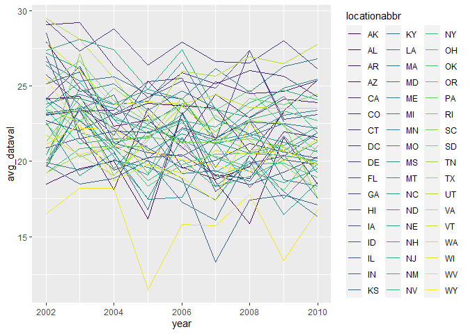

P8105 HW3
================
Lucia Wang (lw3061)
due 2023-10-14

## Problem 1

## Problem 2 = BRFSS

First, clean and format the data.

``` r
data("brfss_smart2010")

brfss = brfss_smart2010 |>
  janitor::clean_names() |>
  filter(topic=="Overall Health", response %in% c("Excellent","Very good","Good","Fair","Poor")) |>
  mutate(
    response = factor(response, levels=c("Poor", "Fair", "Good", "Very good", "Excellent"))
  )
```

*1. In 2002, which states were observed at 7 or more locations? What
about in 2010?*

``` r
states_02 = brfss |>
  filter(year==2002) |>
  separate(locationdesc, into =c("state","county"), sep =5) |>
  select(-state) |>
  group_by(locationabbr) |>
  summarize(n_obs = n()) |>
  mutate(counties_per_state = n_obs/5)
```

There were 6 states observed at 7 or more locations. They were CT, FL,
MA, NC, NJ, PA.

``` r
states_10 = brfss |>
  filter(year==2010) |>
  separate(locationdesc, into =c("state","county"), sep =5) |>
  select(-state) |>
  group_by(locationabbr) |>
  summarize(n_obs = n()) |>
  mutate(counties_per_state = n_obs/5)
```

There were 14 states observed at 7 or more locations. They were CA, CO,
FL, MA, MD, NC, NE, NJ, NY, OH, PA, SC, TX, WA

*2. Filter to only `Excellent` responses and make a spaghetti plot with
a newly calculated average value variable.*

``` r
excellent = brfss |> 
  filter(response=="Excellent") |>
  separate(locationdesc, into =c("state","county"), sep =5) |>
  select(-state) |>
  group_by(year,locationabbr) |>
  summarize(avg_dataval = mean(data_value))
```

    ## `summarise()` has grouped output by 'year'. You can override using the
    ## `.groups` argument.

``` r
excellent_plot = excellent |> 
  ggplot(aes(x=year, y=avg_dataval, group=locationabbr)) + 
  geom_line(aes(color=locationabbr))

excellent_plot
```

    ## Warning: Removed 3 rows containing missing values (`geom_line()`).

<!-- --> The
average data value has fluctuated over the years, with a very general
trend of decreasing between 2002 and 2010. Most fall in the range
between 17.5 to 27.5, but a few outlier states have average values
closer to 10 or 30.

*3. Two-panel plot for `data_value` distribution in NY for 2006 vs
2010.*

``` r
ny_state = brfss |>
  filter(year==2006|year==2010,locationabbr=="NY") |>
  separate(locationdesc, into =c("state","county"), sep =5) |>
  select(-state) |>
  group_by(county)

ny_plot = ny_state |>
  ggplot(aes(x=data_value, y=response)) +
  geom_point(aes(color=county)) +
  facet_grid(.~year)

ny_plot
```

<!-- --> The
highest `data_value` values were for the responses of `Very good` and
`Good`. The scores tended to increase between 2006 and 2010 and the
ranges of scores per response category also widened.

## Problem 3
