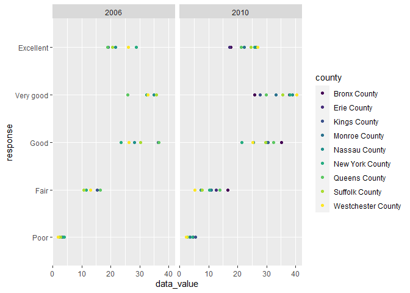
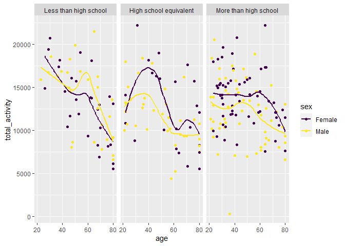

P8105 HW3
================
Lucia Wang (lw3061)
due 2023-10-14

## Problem 1

## Problem 2 = BRFSS

First, clean and format the data.

``` r
data("brfss_smart2010")

brfss = brfss_smart2010 |>
  janitor::clean_names() |>
  filter(topic=="Overall Health", response %in% c("Excellent","Very good","Good","Fair","Poor")) |>
  mutate(
    response = factor(response, levels=c("Poor", "Fair", "Good", "Very good", "Excellent"))
  )
```

*1. In 2002, which states were observed at 7 or more locations? What
about in 2010?*

``` r
states_02 = brfss |>
  filter(year==2002) |>
  separate(locationdesc, into =c("state","county"), sep =5) |>
  select(-state) |>
  group_by(locationabbr) |>
  summarize(n_obs = n()) |>
  mutate(counties_per_state = n_obs/5)
```

There were 6 states observed at 7 or more locations. They were CT, FL,
MA, NC, NJ, PA.

``` r
states_10 = brfss |>
  filter(year==2010) |>
  separate(locationdesc, into =c("state","county"), sep =5) |>
  select(-state) |>
  group_by(locationabbr) |>
  summarize(n_obs = n()) |>
  mutate(counties_per_state = n_obs/5)
```

There were 14 states observed at 7 or more locations. They were CA, CO,
FL, MA, MD, NC, NE, NJ, NY, OH, PA, SC, TX, WA

*2. Filter to only `Excellent` responses and make a spaghetti plot with
a newly calculated average value variable.*

``` r
excellent = brfss |> 
  filter(response=="Excellent") |>
  separate(locationdesc, into =c("state","county"), sep =5) |>
  select(-state) |>
  group_by(year,locationabbr) |>
  summarize(avg_dataval = mean(data_value))
```

    ## `summarise()` has grouped output by 'year'. You can override using the
    ## `.groups` argument.

``` r
excellent_plot = excellent |> 
  ggplot(aes(x=year, y=avg_dataval, group=locationabbr)) + 
  geom_line(aes(color=locationabbr))

excellent_plot
```

    ## Warning: Removed 3 rows containing missing values (`geom_line()`).

<!-- -->

The average data value has fluctuated over the years, with a very
general trend of decreasing between 2002 and 2010. Most fall in the
range between 17.5 to 27.5, but a few outlier states have average values
closer to 10 or 30.

*3. Two-panel plot for `data_value` distribution in NY for 2006 vs
2010.*

``` r
ny_state = brfss |>
  filter(year==2006|year==2010,locationabbr=="NY") |>
  separate(locationdesc, into =c("state","county"), sep =5) |>
  select(-state) |>
  group_by(county)

ny_plot = ny_state |>
  ggplot(aes(x=data_value, y=response)) +
  geom_point(aes(color=county)) +
  facet_grid(.~year)

ny_plot
```

<!-- -->

The highest `data_value` values were for the responses of `Very good`
and `Good`. The scores tended to increase between 2006 and 2010 and the
ranges of scores per response category also widened.

## Problem 3 = NHANES

*1. Load, tidy, merge, and organize the data.*

``` r
demographics = read_csv("nhanes_covar.csv", skip=4) |>
  janitor::clean_names() |>
  mutate(
    sex = case_match(sex,
    1 ~ "Male",
    2 ~ "Female"),
    education = case_match(education,
    1 ~ "Less than high school",
    2 ~ "High school equivalent",
    3 ~ "More than high school"),
    education = factor(education, levels=c("Less than high school", "High school equivalent", "More than high school")),
    seqn = as.character(seqn)
  )  |>
  filter(age >= 21) |>
  drop_na()
```

    ## Rows: 250 Columns: 5
    ## ── Column specification ────────────────────────────────────────────────────────
    ## Delimiter: ","
    ## dbl (5): SEQN, sex, age, BMI, education
    ## 
    ## ℹ Use `spec()` to retrieve the full column specification for this data.
    ## ℹ Specify the column types or set `show_col_types = FALSE` to quiet this message.

``` r
accelerometer = read_csv("nhanes_accel.csv") |>
  janitor::clean_names() |>
  mutate(
    seqn = as.character(seqn)
  )
```

    ## Rows: 250 Columns: 1441
    ## ── Column specification ────────────────────────────────────────────────────────
    ## Delimiter: ","
    ## dbl (1441): SEQN, min1, min2, min3, min4, min5, min6, min7, min8, min9, min1...
    ## 
    ## ℹ Use `spec()` to retrieve the full column specification for this data.
    ## ℹ Specify the column types or set `show_col_types = FALSE` to quiet this message.

``` r
demo_accel = left_join(demographics, accelerometer, by="seqn")
```

The full dataset of demographic variables and accelerometer data has 228
observations.

*2. Produce a table for sex vs education and make a visualization of the
age distributions for each education category.*

``` r
education = demo_accel |>
  group_by(sex, education) |>
  summarize(n_obs = n())
```

    ## `summarise()` has grouped output by 'sex'. You can override using the `.groups`
    ## argument.

``` r
education |> knitr::kable()
```

| sex    | education              | n_obs |
|:-------|:-----------------------|------:|
| Female | Less than high school  |    28 |
| Female | High school equivalent |    23 |
| Female | More than high school  |    59 |
| Male   | Less than high school  |    27 |
| Male   | High school equivalent |    35 |
| Male   | More than high school  |    56 |

For both females and males, the number of observations is greatest in
the “more than high school” education category. There are also more
males overall.

``` r
demo_accel |>
  ggplot(aes(x=age, fill=sex)) +
  geom_histogram(bins=10) +
  facet_wrap(sex~education)
```

<!-- -->

The age distributions for less than high school and high school
equivalent look similar across sex.

Females who had more than high school education were younger on average
as shown by the skewed right age distribution. While males were also
younger on average in the more than high school education category,
there seems to be more of a bi-modal distribution as most males were
either below 50 years or above 60 years old.

*3. Aggregate across minutes and plot age vs total activity by sex and
education.*

``` r
demo_accel |>
  mutate(
    total_activity = rowSums(across(c(min1:min1440)))
  ) |>
  select(-c(min1:min1440)) |>
  group_by(sex) |>
  ggplot(aes(x=age, y=total_activity, color=sex)) +
  geom_point() +
  geom_smooth(se=FALSE) +
  facet_wrap(.~education)
```

    ## `geom_smooth()` using method = 'loess' and formula = 'y ~ x'

<!-- -->

For all education categories, total activity decreased with age.

In the less than high school category, males on average had more
activity than females, surprisingly more at older ages. There was also a
wider range of total activity for this education group.

At higher levels of education, females had more total activity than
males. High school equivalent females were especially more active than
males for ages around 30-50.

For people with more than high school education, there was less activity
overall, and males and females were more similar to each other. However,
the trend lines for this education category did not really capture the
almost “random”-looking dispersion of age and activity distribution.

*4. Make a 3-panel plot for the 24-hour activity time by education level
and use color to indicate sex.*

``` r
activity24 = demo_accel |>
  pivot_longer(
    min1:min1440,
    names_to = "min",
    values_to = "activity"
  ) |>
  separate(min, into=c("minname", "minnum"), sep=3) |>
  mutate(
  minnum = as.numeric(minnum)
  ) 

activity24 |>
  ggplot(aes(x=minnum, y=activity, color=sex)) + 
  geom_point(alpha=0.25, size=0.1) +
  geom_smooth() +
  facet_wrap(.~education) +
  labs(
    x = "Hour of day", y="Activity", title ="Activity over 24 hours by sex and education category"
  )
```

    ## `geom_smooth()` using method = 'gam' and formula = 'y ~ s(x, bs = "cs")'

<!-- -->

Most participants had activity levels between 0-50 when looking at their
activity data by hour.

As expected, the most activity occurred during the day, with a dip in
the early hours of the day. The peaks of all 3 panels was around midday.

Females tended to have more activity than males when looking at trend
lines.

Education did not seem to have an effect on amounts of activity in
general, but when the data is filtered to people with `activity` \< 50
per minute, those in the less than high school category trended with
slightly more activity than the other two education categories.

``` r
activity24 |>
  filter(activity < 50) |>
  ggplot(aes(x=minnum, y=activity, color=sex)) + 
  geom_point(alpha=0.25) +
  geom_smooth() +
  facet_wrap(.~education) +
  labs(
    x = "Hour of day", y="Activity", title ="Activity over 24 hours, with values >50 excluded"
  )
```

    ## `geom_smooth()` using method = 'gam' and formula = 'y ~ s(x, bs = "cs")'

<!-- -->
